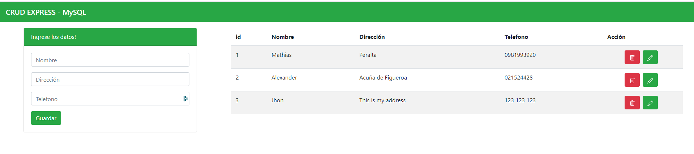
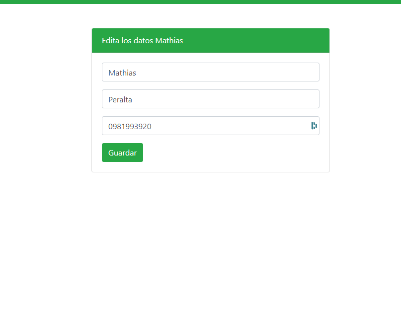

<!DOCTYPE html>
<html lang="en">
    <head>
        <meta charset="UTF-8">
        <meta name="viewport" content="width=device-width, initial-scale=1.0">
        <title>Document</title>
        <link href="https://cdn.jsdelivr.net/npm/bootstrap@5.0.0-beta1/dist/css/bootstrap.min.css" rel="stylesheet" integrity="sha384-giJF6kkoqNQ00vy+HMDP7azOuL0xtbfIcaT9wjKHr8RbDVddVHyTfAAsrekwKmP1" crossorigin="anonymous">
    </head>
    <body>
        

            <h1>CRUD-Node.js-MySQL</h1>
            
Este es un simple ejemplo de una aplicación que nos permite, guardar, editar y eliminar datos utilizando Express como framework del lado del servidor para gestionar las peticiones
                y MySQL para guardar los datos. 
            

            
 Puedes encontrar el sitio web en el siguiente enlace: https://prueba-mp.herokuapp.com/

            

            
             
            
        

    </body>
</html>